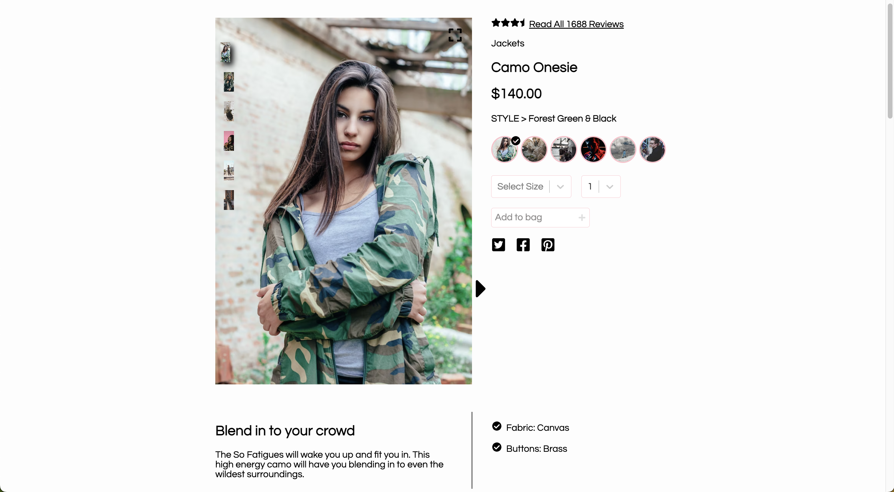

# storeFront Solutions

storeFront Solutions is a full-stack ecommerce web application that allows users to browse products, add items to their cart, and checkout with a credit card.

## Table of Contents

1. [Description](#description)
2. [Technologies](#technologies)
3. [Visuals](#visuals)
4. [Commands to Install and Run](#commands-to-install-and-run)
5. [Code Highlight](#code-highlight)
6. [Authors and Contributors](#authors-and-contributors)
7. [Wins and Improvements](#wins-and-improvements)


## Description

storeFront Solutions is a full-stack ecommerce web application that allows users to view information on a product, it's questions & answers, reviews, and products related to that in view. It was built using React, Node.js, Express, Jest, AWS Ec2, and Redux. 


## Technologies

- [React](https://img.shields.io/badge/React-20232A?style=for-the-badge&logo=react&logoColor=61DAFB)
- [Node.js](https://img.shields.io/badge/Node.js-339933?style=for-the-badge&logo=nodedotjs&logoColor=white)
- [Express.js](https://img.shields.io/badge/Express.js-000000?style=for-the-badge&logo=express&logoColor=white)
- [Jest](https://img.shields.io/badge/Jest-C21325?style=for-the-badge&logo=jest&logoColor=white)
- [Redux](https://img.shields.io/badge/Redux-593D88?style=for-the-badge&logo=redux&logoColor=white)
- [Amazon AWS](https://img.shields.io/badge/Amazon_AWS-FF9900?style=for-the-badge&logo=amazonaws&logoColor=white)


## Visuals




## Commands to Install and Run

```
# Install dependencies
npm install

# Start up development mode 
npm run dev

```


## Code Highlight

This component is shared across multiple sections of the page to render out stars respective of the overall rating of the products.
```javascript 
export const Stars = ({rating}) => {

  var remainder = rating % 1;
  var wholeNum = Math.floor(rating)
  var emptyStar = 5 - wholeNum;

  return (

    <div>{(() => {
      var result = '';
      for (var i = 1; i <= wholeNum; i++) {
        result += ' ';
      }
      if (remainder< 0.5 && wholeNum !== 5) {
        result += ' ';
    } else if (wholeNum !== 5){
        result += ' ';
      }
      if (emptyStar >= 2 && wholeNum !== 5) {
        for (var j = 2; j <= emptyStar; j ++){
          result += ' ';
        }
      }


      return <div id = 'stars' dangerouslySetInnerHTML={{ __html: result }} ></div>;
    })()}
    </div>

  )
}

```
credit [@mdelpape]


This selection of code categorizes the functions called to render out the initial product and it's information upon landing on the home page.
```javascript
// in the index file, on initial render, a sample of products is queried from the api, and the first product is set in the state as the default product in view. The specific information for that product is then queried using the 'getSpecificProduct' function
  useEffect(() => {
    if (!product.id) { // if no product has been loaded, then this is the initial render, and we need to fetch the default data
      dispatch(getInitialData()) // get initial data and set the id in the state
      .then(() => dispatch(getSpecificProduct())) // then get product information for that id
      // .then(() => dispatch(getStyles())); // then get styles and update them
    }
  }, []);

export const getSpecificProduct = createAsyncThunk('product/getSpecificProduct', async(productId, thunkAPI) => {
  try {
    if (!productId) {
      productId = thunkAPI.getState().product.id;
    }
    return axios.get(`/products/${productId}`)
    .then(res => res.data)
    .catch(err => {throw new Error (err)});
  } catch (err) {
    return thunkAPI.rejectWithValue(err);
  }
}); 
      /// product slice extra reducers' builder has a case that responds to action type created by getSpecifcProduct
      .addCase(getSpecificProduct.fulfilled, (state, action) => {
        state.id = action.payload.id;
        state.productInformation = action.payload;
        state.availableStyles = [];
        state.currentStyle = {};
        state.isLoading = false;
      })
``` [@jacqueline-kelly]


This code section describes behavior and view of the carousel module of the related products components.
```
javascript
  {isHovered ? (
    <Carousel
      selectedItem={selectedImageIndex}
      showStatus={false}
      showIndicators={false}
      onChange={handleThumbnailChange}
      data-testid="thumbnailCarousel"
    >
      {product.productStyles[0].photos.map((photo, index) => (
        <div key={index} onClick={(e) => handleThumbnailClick(index, e)} >
              
        </div>
      ))}
    </Carousel>
  ) : (
    
  )}
```[@jerryrenn]


### Node.js Route

This function describes how the questions are retrieved from the api.
```javascript
module.exports = {
  getQuestions: (req, res) => {
    //TODO
    const product_id = req.query.product_id;
    const count = req.query.count;
    const page = req.query.page;
    //console.log(req.query);
    //would need to extract page and count from req and include it as a parameter inside the URL
    axios.get(`${URL}/qa/questions`, { headers, params: {product_id: product_id, count:count, page: page } })
    .then(response => {
     //console.log(response);
      res.json(response.data.results);
      console.log('Successful getQuestions call to the API');
    })
    .catch(error => {
      console.log('Error fetching products from API: ', error);
      res.status(500);
    });
  }
```[@sahidadin]


## Authors and Contributors

- [@jerryrenn](https://github.com/jerryrenn)
- [@mdelpape](https://github.com/mdelpape)
- [@sahidadin] (https://github.com/sahidadin)
- [@jacqueline-kelly] (https://github.com/jacqueline-kelly)

## Wins and Improvements

The main win of the FEC-Ecommerce project was that it was able to handle a high volume of traffic without any issues. The project was also designed to be responsive desktop devices.

Currently, the app is not designed for mobile. An improvement would be to introduce a mobile compatible layout.
